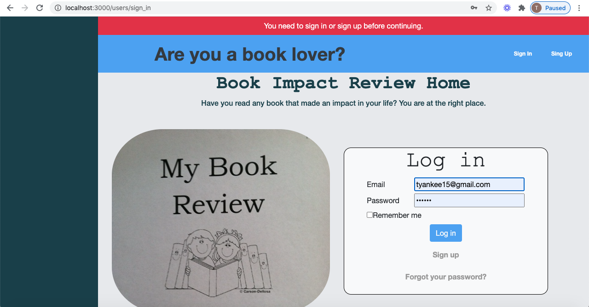
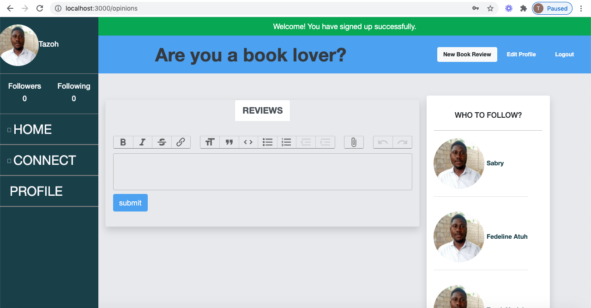
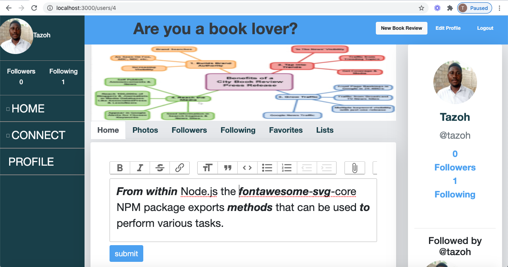

# Book Review Social Media Website


> Ruby's on Rails Book Review Social Media Website Project 

## Concept
>  As wikipedia define it: A Social networking sites allow users to share ideas, digital photos and videos, posts, and to inform others about online or real-world activities and events with people in their network. Depending on the social media platform, members may be able to contact any other member. In other cases, members can contact anyone they have a connection to, and subsequently anyone that contact has a connection to, and so on. The success of social networking services can be seen in their dominance in society today, with Facebook having a massive 2.13 billion active monthly users and an average of 1.4 billion daily active users in 2017.
In this line, book review social media website is a platform for users to post reveiews on books they have read that made impacts in their lives.

## Screenshot



## Usage

- This project intends to practice my skills building a full working MVP;
- Prepare data architecture documentation;
- Work with deployment to Heroku.<br>

## 🎥 Video Presentation
[Link Presentation Video](https://www.loom.com/share/8137eb3820f64e9e84613e3d964c878b)


## Live Demo

[Project live website](https://evening-mountain-82652.herokuapp.com/)

## 🛠 Getting Started

> To get a local copy up and running follow these simple example steps.

- Go to the main page of the repo.
- Copy this Code `git@github.com:t-yanick/book-impact.git`


### 📝 Setup

 - Open a terminal
 
 - Copy this code : 
        ```
        git clone git@github.com:t-yanick/book-impact.git
        ```
 - Copy this code to install the gems :
         ```
        bundle install
        ```
 - Copy this code to migrate th db :
 
        ```
        rails db:create && rails db:migrate && rails db:seed
               
        
- Visit `http://localhost:3000`


### Automated Tests

- In root directory copy this into your terminal:
            ```
           rspec
            ```
- All the test should pass   

### Build With

- Ruby 2.6.5
- Ruby on Rails 6.0.3

### :gem: Gems and tools

- Action Text and Trix: Style forms and rich text editors
- Action Storage: Attach images
- Bootstrap: Styles
- Devise: manage users
- Faker: Seed fake users and diferent models that you have
- Font-awesome: Include icons in methods
- Hirb: Style tables in console to visualize them better
- Linters: Rubocop
- Simple_form: Improve the way to setup forms
- Rspec-rails: test all content in your rails app

### Deployed On:
- Heroku         

## 👤 Authors


👤 **Tazoh Yanick Tazoh**

- GitHub: [@t-yanick](https://github.com/t-yanick)
- Twitter: [@ElTazoh](https://twitter.com/ElTazoh)
- Linkedin: [Tazoh Yanick](https://linkedin.com/in/tazoh-yanick)


## 🤝 Contributing

Contributions, issues and feature requests are welcome!

Feel free to check the [issues page](https://github.com/t-yanick/book-impact/issues).

## Show your support

Give a ⭐️ if you like this project!

## Acknowledgments

- Hat tip to anyone whose code was used
- You can find the original project here: [link](https://www.behance.net/gallery/14286087/Twitter-Redesign-of-UI-details)
- [Microverse](https://www.microverse.org/)
- etc

## 📝 License

This project is [MIT](lic.url) licensed.
